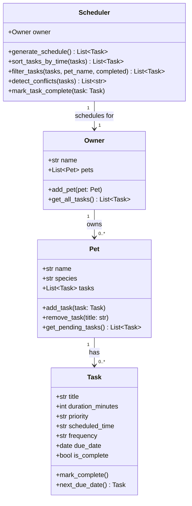

# PawPal+ UML Diagram (Draft)

```mermaid
classDiagram
    class Task {
        +str title
        +int duration_minutes
        +str priority
        +str scheduled_time
        +str frequency
        +date due_date
        +bool is_complete
        +mark_complete()
        +next_due_date() Task
    }

    class Pet {
        +str name
        +str species
        +List~Task~ tasks
        +add_task(task: Task)
        +remove_task(title: str)
        +get_pending_tasks() List~Task~
    }

    class Owner {
        +str name
        +List~Pet~ pets
        +add_pet(pet: Pet)
        +get_all_tasks() List~Task~
    }

    class Scheduler {
        +Owner owner
        +generate_schedule() List~Task~
        +sort_tasks_by_time(tasks) List~Task~
        +filter_tasks(tasks, pet_name, completed) List~Task~
        +detect_conflicts(tasks) List~str~
        +mark_task_complete(task: Task)
    }

    Owner "1" --> "0..*" Pet : owns
    Pet "1" --> "0..*" Task : has
    Scheduler "1" --> "1" Owner : schedules for
```
